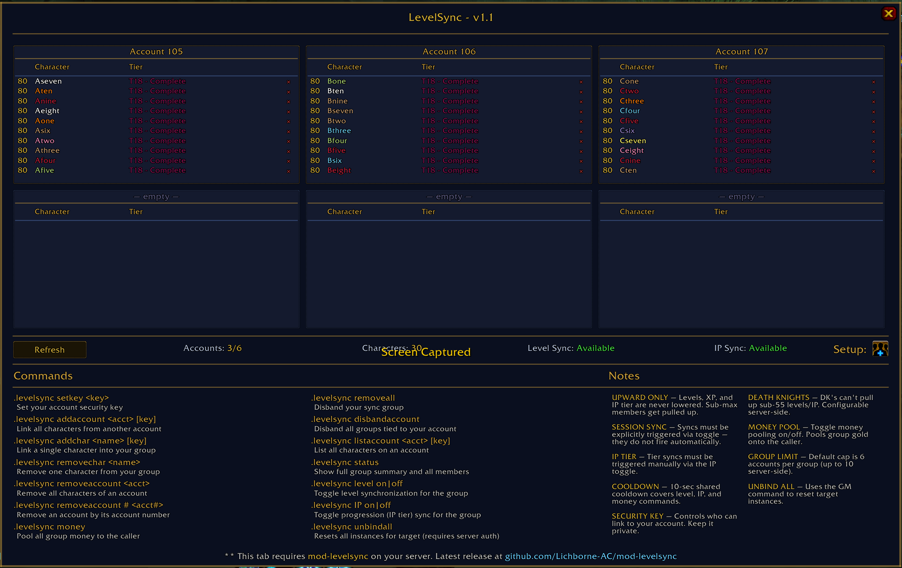

# LevelSyncUI

A World of Warcraft addon (WotLK 3.3.5a, Azerothcore) that provides a graphical UI for [mod-levelsync](https://github.com/Lichborne-AC/mod-levelsync).

## Overview

LevelSync provides a graphical interface that lets you view your levelsync group directly from an in-game panel. It displays all accounts and characters in your sync group in a clean 3×2 grid, with levels, class (in colors), and IP tier progression.

## Screenshot



## Features

- **3×2 account grid** — up to 6 accounts, 10 characters each
- **Class-colored character names** — each class displays in its official color
- **IP tier progression** — color-coded by tier (Molten Core through Ruby Sanctum)
- **Slash command reference** — all `.levelsync` commands listed directly in the panel

## Requirements

- AzerothCore private server with [mod-levelsync](https://github.com/Lichborne-AC/mod-levelsync) installed
- WoW client version 3.3.5a 

## Installation

1. Download or clone this repository
2. Copy the `LevelSync` folder into:
   ```
   World of Warcraft/Interface/AddOns/LevelSync/
   ```
3. Launch WoW and enable **LevelSync** on the addon selection screen

## File Structure

```
LevelSync/
├── LevelSync.toc         — Addon manifest
├── LevelSync.lua         — Core logic: commands, event listener, state machine, minimap
├── LevelSync_UI.lua      — All UI frames and widgets
└── libs/
    ├── LibStub/
    ├── LibDataBroker-1.1/
    └── LibDBIcon-1.0/
```

## Compatibility

- WoW 3.3.5a
- Requires mod-levelsync on the server side

